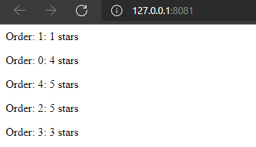

# Network Programming 
Laboratory N1. Restaurant Simulator. Dinning Hall

## Table of contents
* [Description](#description)
* [Technologies](#technologies)

## Description
This repository represents a draft of my "hardwork" in creating a server and a Docker image of the Dinning Hall. 
The code generates order and sends them as array structure

In the ```dininghall.py``` file we have 3 classes: ```DiningHall```, ```Table``` and ```Waiters```. When we construct the ```DiningHall``` in ```app.py```, it calls the constructors of ```Table``` and ```Waiters```.

The ```Table``` class has information about the ```table_id```, its ```status``` (if it is free or not), and the menu of foods (as it will generate orders through ```create_order()``` function, which represents a dictionary as it is shown below).

```json
{
    "order_id": 1,
    "table_id": 1,
    "waiter_id": 1,
    "items": [ 3, 4, 4, 2 ],
    "priority": 3,
    "max_wait": 45,
    "pick_up_time": 1631453140 
}
```
In the ```Waiters``` class we construct a list of waiters, with the following information stored in a dictionary: id and status. Initially, all the waiters are free. 

```py
for i in range(nr_of_waiters):
    self.waiters.append({
        'waiter_id' : i,
        'state' : 'free'
        })
```
We generate orders in ```app.py``` by calling the method ```create_orders()```, with a constant number of orders, defined in the DiningHall class:
```py
def create_orders(self, number_of_orders):
    for i in range(number_of_orders):
        self.waiters.take_order(self.tables, i)
```
It calls the ```take_order()```, which passes through the ```tables_list```, and searches for a free waiter, who is ready to pick the order from the customers. It was taken in consideration that the amount of time needed to take an order varies from 2 to 4 time units.
```py
order['time_await'] = random.randint(2, 4)
```
We save this ```time_await```, as it is needed to pause the send request, after this, it is deleted from ```order[]```
```py
def send_order(self, order):
    time.sleep(order['time_await'])
    del order['time_await']
    requests.post('http://localhost:8080/order', json=order)
```
In the ```app.py``` we read the ```foods.json``` file, create the dinning_hall object, which takes as parameters the number of tables, number of waiters and the menu of our restaurant.

Python threads are a form of parallelism that allow your program to run multiple procedures at once. Parallelism in Python can also be achieved using multiple processes, but threads are particularly well suited to speeding up applications that involve significant amounts of I/O (input/output).

The ```concurrent.futures``` module from python provides a high-level interface for asynchronously executing callables.

```ThreadPoolExecutor``` is an ```Executor``` subclass that uses a pool of threads to execute calls asynchronously.

```py
executor = futures.ThreadPoolExecutor(len(dinning_hall.waiters.waiters))
```
Here we instantiate an instance of our `ThreadPoolExecutor` and pass in the maximum number of waiters that we want it to have. In this case we’ve defined it as the length of ```waiters[]``` which essentially means this thread pool will only have 5 (in our case), concurrent threads that can process any jobs that we submit to it.

In order to give the threads within our ThreadPoolExecutor something to do we can call the ```submit()``` function which takes in a function as its primary parameter like so:
```py
future = executor.submit(dinning_hall.waiters.send_order, order)
```
Also in ```app.py```, we have a method called ```distribution()```, which calculates the rating of the ```json``` file sent by the kitchen with the prepared order.



## Technologies
* IDE : Visual Studio Code
* Programming language : Python
* Additional software used in project: Docker